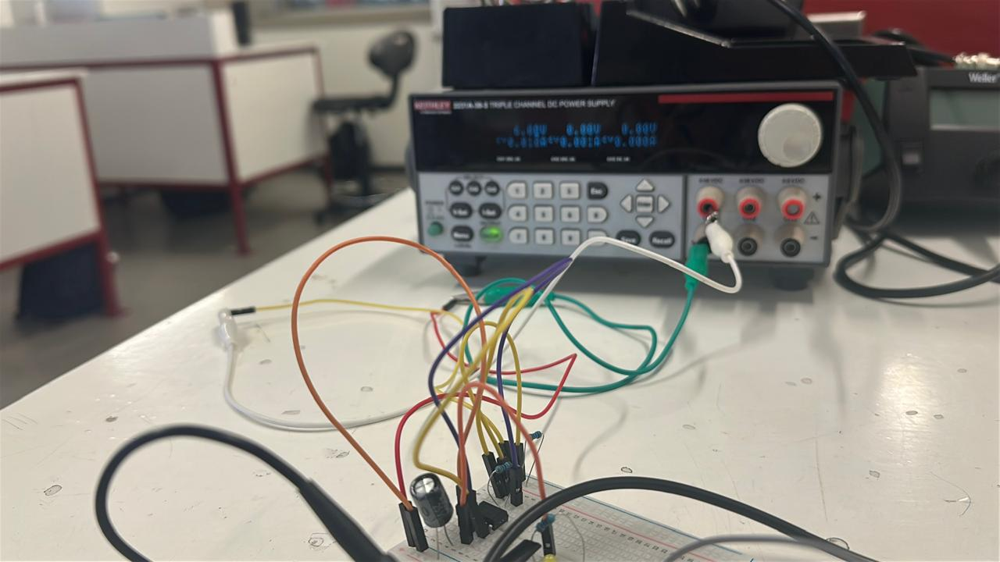
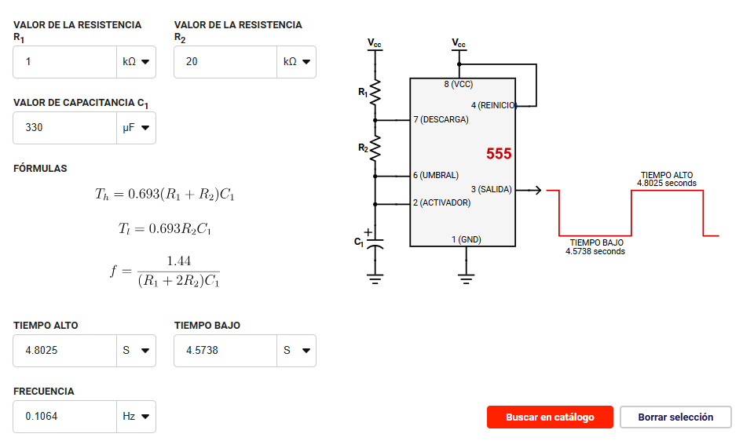
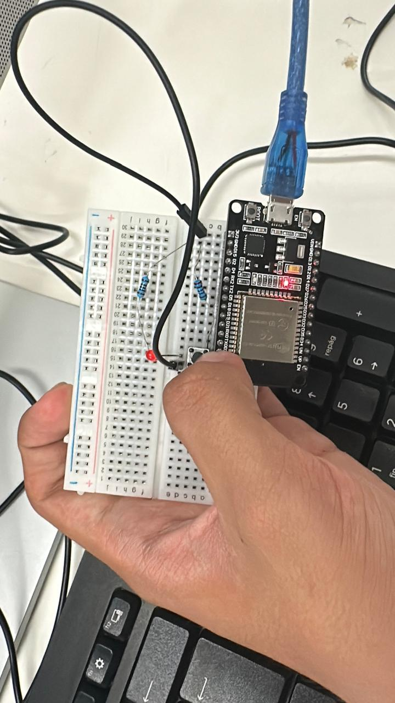
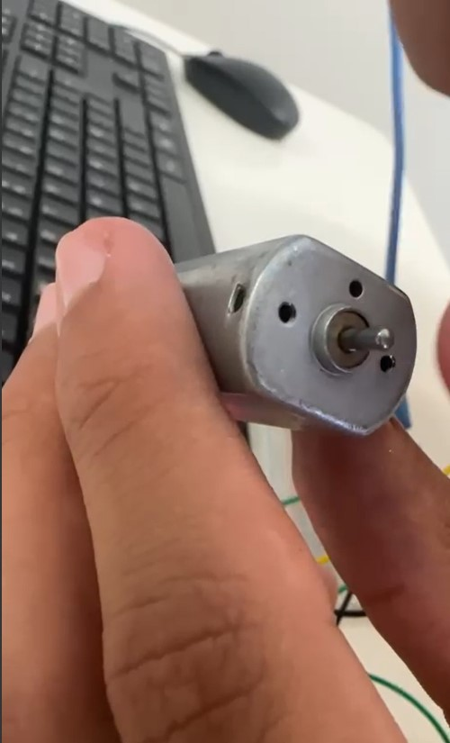
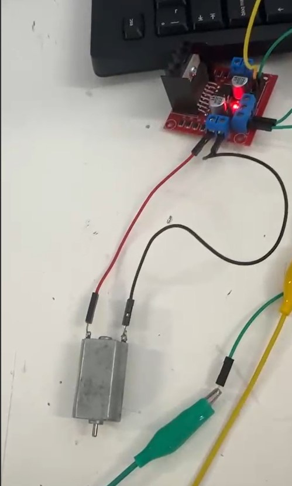

# Documentación, Practicas
# Nombre de la practica: Funcionamiento y uso de la compuerta 74ls555
Autores
## Garcia Elvira Pedro Emmanuel
## Barriga Gómez Diego
## Fecha: 5 de Septiembre del 2025
Asignatura: Introducción a la Mecatronica

# Práctica con el Temporizador 555

## Introducción
En esta práctica de la materia **"Introducción a la Mecatrónica"**, se trabajó con el **integrado 555**, un componente que permite **activar o desactivar funciones** dentro de un circuito durante un tiempo determinado.  
Este intervalo puede modificarse ajustando los valores de las **resistencias** y **capacitores** empleados en el diseño.

---

## Objetivo de la práctica
El propósito fue lograr que un **LED** se encendiera durante un periodo de **3 a 5 segundos** y permaneciera **apagado** durante el mismo intervalo de tiempo.  
De esta forma, se buscó comprender cómo el **555** puede controlar la frecuencia de parpadeo en función de los componentes conectados.

---

## Uso de capacitores
Durante la clase se enfatizó en el uso de los **capacitores**, ya que el tema principal era analizar **sus funciones y aplicaciones** dentro de un circuito temporizador.  
Los capacitores se utilizaron para almacenar y liberar energía, permitiendo modificar los tiempos de encendido y apagado del LED.

---

## Cálculos de resistencia
Se nos proporcionó una **calculadora de componentes**, la cual permitía ingresar los valores de dos resistencias y un capacitor.  
Una de las resistencias controlaba el **tiempo de encendido**, mientras que la otra regulaba el **tiempo de apagado** del LED.

Además, la calculadora mostraba el **diagrama de conexión** de los pines del 555 hacia la **protoboard**, lo que facilitó seguir correctamente el esquema del circuito.

---

## Componentes utilizados
En el caso de nuestro equipo, seleccionamos los siguientes valores:

- **Resistencia 1:** 1 kΩ  
- **Resistencia 2:** 20 kΩ  
- **Capacitor:** 330 µF  

Estos componentes permitieron obtener el comportamiento deseado del circuito, con un parpadeo del LED dentro del rango de **3 a 5 segundos** para cada ciclo.

---

## Conclusión
Gracias a esta práctica comprendimos mejor cómo **las resistencias y los capacitores** influyen en el **tiempo de respuesta** de un circuito con el **temporizador 555**.  
Además, reforzamos la habilidad para **interpretar y armar circuitos** basados en diagramas electrónicos.






**Pagina**
(https://www.digikey.com.mx/es/resources/conversion-calculators/conversion-calculator-555-timer?srsltid=AfmBOopExlAJ0hL2w6AKdoyEliUHPJePR_9zs5x8V6Y6rbOffRCSPgXM)


---

# Nombre de la practica: Funcionamiento y uso de la compuerta 74ls555
Autores
## Garcia Elvira Pedro Emmanuel
## Barriga Gómez Diego
## Fecha: 12 de Septiembre del 2025

# Descripción
En esta práctica se trabajó con diversos **componentes electrónicos** —entre ellos el **ESP32**, **jumpers** y una **protoboard**— con el objetivo de implementar un circuito capaz de **encender y apagar un diodo LED** mediante la **programación del microcontrolador ESP32** desde un entorno computacional.

---

# Objetivos

## General
En esta segunda practica de la asignatura **"Introducción a la Mecatrónica"**, se buscó diseñar e implementar un circuito controlado por un **ESP32**, programado para **activar y desactivar un LED** de acuerdo con las instrucciones definidas en el código desarrollado durante la sesión.

## Específicos
- **Objetivo 1:** Superar el desempeño obtenido en la primera practica, consolidando los conocimientos adquiridos y aplicándolos de manera más eficiente.  
- **Objetivo 2:** Profundizar en la comprensión del funcionamiento del **ESP32**, así como en la lógica de control digital mediante programación estructurada.  
- **Objetivo 3:** Fortalecer las habilidades en el **ensamblaje de circuitos electrónicos** y la **implementación de retardos temporales (delay)** dentro de un programa.

---

# Alcance y Exclusiones

- **Incluye:**  
  - Los **códigos fuente** empleados para la ejecución de cada circuito.  
  - **Evidencias fotográficas** de las conexiones realizadas en la protoboard.  


---

# Procedimiento 1
1. **Revisión de materiales:** Se verificó la disponibilidad y correcto funcionamiento de los componentes electrónicos requeridos para la práctica.  
2. **Configuración inicial:** Se realizó una breve introducción al uso del **microcontrolador ESP32**, abordando su conexión con la computadora y su programación mediante un entorno de desarrollo compatible.  
3. **Diseño del circuito:** Se implementó un circuito básico en la **protoboard**, conectando un **LED** a uno de los **pines digitales de salida** del ESP32, junto con la resistencia correspondiente para limitar la corriente.  
4. **Programación:** Se desarrolló un **script en lenguaje C/C++**, el cual controla el encendido y apagado del LED utilizando la función `delay()` para generar intervalos de tiempo visibles entre ambos estados.  
5. **Ejecución y verificación:** Finalmente, se cargó el programa al ESP32 y se comprobó su correcto funcionamiento, verificando que el LED alternara su estado de encendido y apagado de acuerdo con el código implementado.

### Codigo

```cpp
const int led = 33; // Puerto del ESP32 al que está conectado el LED

void setup() {
  Serial.begin(115200);
  pinMode(led, OUTPUT);
}

void loop() {  // Repetición constante del encendido y apagado
  digitalWrite(led, 1); // Encendido
  delay(1000);          // Retraso del encendido y apagado del LED
  digitalWrite(led, 0); // Apagado
  delay(1000);
}
```
---
# Procedimiento 2
Partiendo del código y circuito desarrollados en la primera práctica, se realizaron **modificaciones tanto en el hardware como en el software**.  

En esta ocasión, se añadió un **botón pulsador** al circuito con el propósito de **controlar manualmente el encendido y apagado del LED** al presionarlo.  
El botón se conectó al **pin 34 del ESP32**, configurado como **entrada digital**.  

Para implementar esta nueva funcionalidad, se declaró una **nueva constante** en el código correspondiente al pin del botón, y se agregaron **estructuras condicionales** que permiten determinar el estado del LED en función de la lectura del pulsador:  
- Cuando el botón es presionado, el **LED se enciende**.  
- Cuando el botón no está presionado, el **LED permanece apagado**.  

Estas modificaciones permitieron ampliar el control del sistema, pasando de un funcionamiento automático a uno **interactivo**, donde la acción del usuario influye directamente en el comportamiento del circuito.

```cpp
const int led=33; // LED

const int btn=34; // BOTON

void setup() {

  Serial.begin(115200);

  pinMode(led, OUTPUT); // SALIDA

  pinMode(btn, INPUT); // ENTRADA


}

void loop() {

  int estado = digitalRead(btn); 

  if(estado == 1){

     digitalWrite(led,1);  // PRENDIDO
  }

  else {

    digitalWrite(led,0); // APAGADO

  }

}
```

# Procedimiento 3
Para este tercer ejercicio se utilizó la aplicación **"Serial Bluetooth Terminal"**, la cual permite **comunicarse con el ESP32 vía Bluetooth**. Mediante la terminal de la aplicación, se pueden enviar señales al microcontrolador para **controlar el encendido y apagado del LED** de acuerdo con el código programado.  

Partiendo del **código desarrollado en el Procedimiento 2**, se realizaron las siguientes modificaciones:  

1. Se añadió la librería **`#include "BluetoothSerial.h"`** para habilitar la comunicación Bluetooth en el ESP32.  
2. Se eliminó la constante y configuración del botón físico, reemplazando la entrada por la **conexión Bluetooth**, que se denominó **LR23** en el código.  
3. Las estructuras condicionales fueron adaptadas para funcionar con la aplicación:  
   - Si la terminal envía el mensaje `"Prende"`, el **LED se enciende**.  
   - Si se recibe cualquier otro mensaje, el **LED permanece apagado o se apaga**.  

Estas modificaciones permitieron controlar el LED de manera **remota mediante Bluetooth**, demostrando cómo integrar comunicaciones inalámbricas con sistemas embebidos.

```cpp
"#"include "BluetoothSerial.h"

BluetoothSerial SerialBT;

const int led=33;


void setup() {

  Serial.begin(115200);

  SerialBT.begin("LR23"); // Dipositivo bluetooth

  pinMode(led, OUTPUT);

}

void loop() {

  if(SerialBT.available()){

    String mensaje = SerialBT.readString();

    Serial.println("Recibido: " + mensaje);

    if(mensaje == "Prende"){

     digitalWrite(led,1);

    }

    else {

      digitalWrite(led,0);
    }

  }

  delay(100);

 }
```

# Conclusión
La práctica permitió fortalecer la comprensión sobre la interacción entre **hardware y software** en sistemas embebidos, aplicando distintos métodos de control de un **LED** utilizando el **ESP32**.  

En el **Procedimiento 1**, se desarrolló un circuito básico con encendido y apagado automático mediante retardos temporales, lo que reforzó la comprensión del **control temporal** en programación.  

En el **Procedimiento 2**, se integró un **botón físico** como entrada digital, permitiendo el control manual del LED mediante estructuras condicionales, lo que amplió la experiencia en **interacción hardware-software** y en la gestión de entradas digitales.  

Finalmente, en el **Procedimiento 3**, se implementó **comunicación inalámbrica vía Bluetooth** utilizando la librería `BluetoothSerial.h`, logrando controlar el LED de manera remota desde una aplicación móvil, lo que permitió explorar la integración de **sistemas embebidos con comunicaciones inalámbricas**.  

En conjunto, estas prácticas consolidaron conocimientos en **configuración del ESP32**, **control de salidas digitales**, **gestión de entradas y condicionales**, así como en la **interfaz con dispositivos externos** mediante Bluetooth.



---

# Nombre de la practica: Funcionamiento y uso de la compuerta 74ls555
Autores
## Garcia Elvira Pedro Emmanuel
## Barriga Gómez Diego
## Fecha: 19 de Septiembre del 2025

# Descripción
En esta tercer practica de la materia **Introducción a la Mecatrónica**, nuestro objetivo fue realizar la **conexión y programación de un motor DC** para controlar su **encendido, apagado y velocidad** utilizando un **ESP32**.  
Se emplearon los **pines digitales** y la función `ledcWrite()` para variar la velocidad del motor mediante la técnica de **modulación por ancho de pulso (PWM)**.

---

# Objetivos

## General
Aprender a controlar un **motor DC** utilizando un **microcontrolador**, comprendiendo el funcionamiento de los **pines de salida** y el control de velocidad mediante **PWM**.

## Específicos
- Programar el **encendido y cambio de giro** del motor.  
- Implementar el **control de velocidad** utilizando la función `ledcWrite()`.  
- Comprender la relación entre **frecuencia, ciclo de trabajo y velocidad del motor**.

---

# Alcance y Exclusiones

- **Incluye:**  
  - Conexión del **motor DC** a través del driver y pines de salida del **ESP32**.  
  - Código para **encendido, apagado y cambio de giro** del motor.  
  - Código con **control progresivo de velocidad** mediante PWM.  

- **No incluye:**  
  - Otros tipos de motores o controladores distintos al motor DC y driver utilizados.  

---

# Procedimiento
1. Se identificaron los **pines de salida** del microcontrolador y se realizaron las **conexiones correspondientes** del motor DC mediante el driver.  
2. Una vez conectado, se desarrolló un **código básico** que permitiera:  
   - Encender el motor en una dirección.  
   - Detenerlo después de un intervalo de 3 segundos.  
   - Cambiar su giro en sentido contrario, manteniendo los mismos intervalos de tiempo.  

Este procedimiento permitió **verificar la correcta integración de hardware y software** para controlar el motor DC y sentar las bases para implementar control de velocidad posteriormente.
---
Anexando a continuación el **primer código** utilizado :
---
```cpp
#define in1 32
#define in2 33

void setup() {
  pinMode(in1, OUTPUT);
  pinMode(in2, OUTPUT);
}

void loop() {
  digitalWrite(in1,1);
  digitalWrite(in2,0);
  delay(3000);
  digitalWrite(in1,0);
  digitalWrite(in2,0);
  delay(3000);
  digitalWrite(in1,0);
  digitalWrite(in2,1);
  delay(3000);
}
```
---
# Control Progresivo de Velocidad del Motor

Como segunda parte de este proyecto, y tomando como base lo realizado previamente, se programó el **motor DC** de manera que fuera posible **controlar su velocidad de forma gradual**.  
El objetivo fue que el motor **aumentara y disminuyera progresivamente su velocidad**, en lugar de detenerse o arrancar de manera abrupta.  

Esto es importante porque, aplicado a un motor real, un arranque o paro repentino podría generar **pérdida de control** o incluso un **desgaste innecesario** en el mecanismo.

---

A continuación, se presenta el **segundo código** utilizado para implementar esta funcionalidad en el proyecto:

```cpp
pinMode(in1, OUTPUT);
  pinMode(in2, OUTPUT);
  //Control de velocidad
  ledcAttachChannel(pwm,1000,8,0); //pin,frecuencia,bits,canal   //config

}

void loop() {
  for(vel=0; vel<=256;vel++){
  ledcWrite(pwm,vel);
  digitalWrite(in1,1);
  digitalWrite(in2,0);
  delay(10);
  }
  for(vel=256;vel>=0;vel--){
  digitalWrite(in1,1);
  digitalWrite(in2,0);
  delay(10);
  }
}
```

# Conclusión

La practica 3 permitió profundizar en el **control de motores DC** mediante un **ESP32**, combinando tanto la parte de encendido/apagado y cambio de giro, como el control progresivo de velocidad.  

En la primera fase, se logró comprender la relación entre los **pines digitales**, la lógica de control y la implementación de **intervalos temporales** para encender y apagar el motor de manera controlada.  

En la segunda fase, se incorporó el **control gradual de velocidad** mediante la técnica de **modulación por ancho de pulso (PWM)** utilizando la función `ledcWrite()`. Esto permitió **evitar arranques y paros bruscos**, lo cual es fundamental para proteger el motor y el mecanismo acoplado, además de ofrecer un comportamiento más realista y seguro del sistema.  

En conjunto, el proyecto consolidó conocimientos sobre:  
- Programación de microcontroladores para control de actuadores.  
- Uso de **PWM** para control de velocidad de motores.  
- Integración de **hardware y software** para aplicaciones de mecatrónica.  
- Importancia de implementar estrategias de control progresivo para proteger los componentes y mejorar la eficiencia del sistema.

- 
- 
